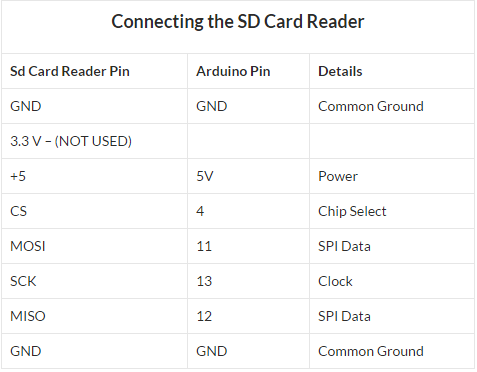

# Data-Logger-Arduino
Standalone Temperature,Humidity data logger using Arduino Nano.
Low cost miniature design for long term statistical climate analysis.
Real-time clock module and AVR buit in sleep timers used for long battery life and logging period.
Data log saved to standard SD card.

Open source Libraries Used:
i2c Library-Arduino Inc
DHT-11 Library-Arduino Inc
DS3231 Library-Arduino Inc
SD Library-Arduino Inc

